# Capstone Project 2:  Twitter Political Compass Machine 

## 1. Introduction
In the year 2020, US politics has been as Polarized as ever.  With Donald Trump being our president, fake news flowing across multiple social media platforms, the Democrats and Republicans' division has been clear.  This trend of continuous deterioration partisanship has cause violence during this unsettling time.  According to the Pew Research center, the partisan gap on economy has increased from 18 to 30 between 1994 and 2017.  However, is this division only in the policy, or is embedded in the way we talk?  

With social media, like Twitter, being used as a powerful communication method.  **I will create a Political identity machine using the leaders of Political Parties and use them to identify their followers' political compass/identity.**

## 2. Data
The Data is scrapped from the Web using Twitter API.  There is a 7 days limit on the free version of Twitter API.  Therefore, I have scrapped the tweets of all US Senators and Presidential Candidates (It is an election year) between the date of 09-07-2020 to 09-12-20.  However, this machine is designated to be a continuously evolving model and requires constant updates.  

## 3. Methodology
Instead of evaluating all of the senator’s tweets as a whole, which would cause the number of features to become overly large, We have decided only to use the tweets of leaders of each political party.  How do we determine the political leaders?  We selected names which are known to commoners.  For example, if today, I asked you who the senators of Idaho is?  You probably have no idea, but I would like to bet that you know Mike Pence, Mitch McConnell.  To make a list even and prevent Data Imbalance, I manually selected 4 leaders from each party and used all the tweets as features.  

The lists of leaders are

  Democrats: Joe Biden (Presidential Nominee), Kamala Harris (VP Nominee), Bernie Sanders, Elizabeth Warren
  Republicans: Donald Trump (President), Mike Pence (Vice President), Mitch McConnell, Ted Cruz

The predictive features and Machine Learning model will be focusing on these individual only

## 4. Data Cleaning + Exploratory Data Analysis + Feature Engineering
Unlike numeric features, when dealing with text (or tweets), the correlation between text is difficult to quantify, and there is really no standard way or order to handle text.  For example, to evaluate the tweets' sentiment, it is probably better to keep the stop words.  However, stop words are terrible for a bag of words feature engineering because they are usually meaningless.  Therefore, I will provide a chronic list of the steps I took to generate dataframe for my predictions.

### 1. Screen out Retweet - Remove Hyperlink  
Since this project aims to evaluate tweets from the leader and their pattern, we are not interested in the retweets, which is their words even if it might resonate with their message.  This step is easy because tweeters automatically format retweet as RT.  Just find them and remove them.

We also remove all hyperlinks because they are not part of the speech.  Furthermore, they can mess up the readability score evaluation.  

### 2. Add in Readability Score - Redo Readability Score
To add in the readability score, we use the **textstats** package from python.  This package provides multiple methodologies to evaluate the readability, complexity, and grade level of a particular corpus.  The specific evaluation methods we used are

- Automated Readability Index (ARI): https://en.wikipedia.org/wiki/Automated_readability_index

- Dale Chall Readability (DCR): it uses formula uses a list of 3000 words that fourth grade American can reliably  understand and using this list to see how difficult the sentence are: https://en.wikipedia.org/wiki/Dale%E2%80%93Chall_readability_formula

- Text Standard (TS): An aggregation of all methods in the package 

Then we evaluate their overall trend using Histograms.

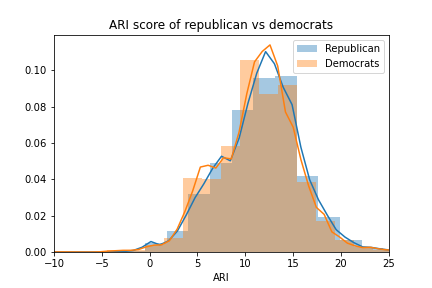
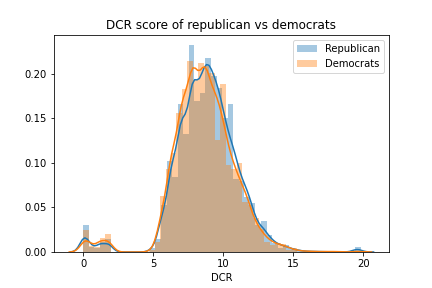
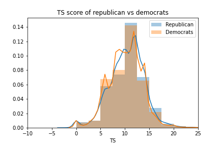

Base on the histogram, there are no significant differences between the tweets made by Republicans vs Democrats.  This might be the fact that tweets only allow 280 characters maximum.  Therefore, there is not enough length to capture the difference between the two parties.  

We didn’t evaluate the readability of tweets for each senator.  However, we did assess the readability of the leaders from each party.  

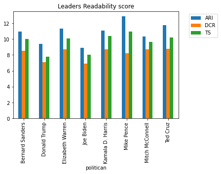

According to their Median readability score, no conclusion is drawn.  However, I think it is quite interesting that Joe Biden and Donald Trump have the lowest readability score in general  

### 3. Generate Word Clouds
To do more Exploratory Data Analysis, we will generate a word cloud to see some of the leaders' most common words and do a quick view to see if there is anything noticeable.  

To do more Exploratory Data Analysis, we will generate a word cloud to see some of the leaders' most common words and do a quick view to see if there is anything noticeable.  Also, we have generated two word clouds for each leader, before and after retweets removal.  The reasoning behind this is because retweet may share the sentiment that the leaders are trying to convey.  

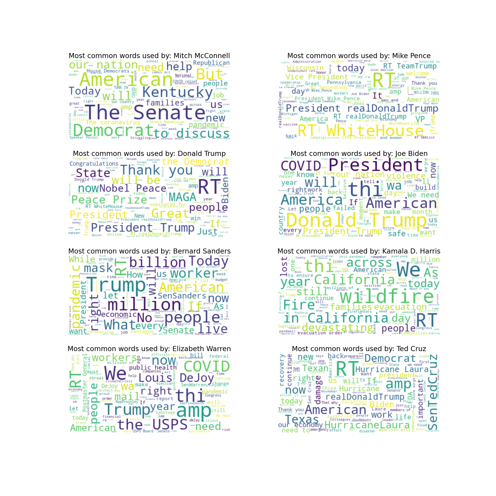

It is pretty awesome to see how words varied between the leaders.  Warren uses Covid and pandemic a lot, Cruz uses china and Chinese a lot. Interesting here is that Biden and McConnell don't retweet a lot.  It seems like democratic leaders criticized Trump a lot.  America is a common word for most of the politician.  The Senator also refer to their home state a lot.  MAGA (Make America Great Again) is exclusively on Trumps tweets only.  Bernie Sanders uses million and billion, which is not commonly used by other leaders.  Base on our word clouds, it seems like we have some assurance that our model could work. 

### 4. Additional Data Cleaning (Punctuation Removal, Text Segementation, Stop Words Removal)

Before producing the next round of world cloud analysis, I performed some additional data cleaning, including punctuation removal, stop words removal, and word segmentation (aka tokenize the words).  These are fundamental Nature Language Process (NLP) techniques that you will probably encounter in any NLP problems.  Stop words are common words that provide no real meaning to the document. An example of this is short functional words such as [the, is, at, which, on]. Remove these words and punctuation allows you to retrieve the most important words within your corpus without drowning them under numerous common words.  Another way to think about it is to limit the background noise of your document.

### 5. Generate Word Clouds Again wo Stops words and RT

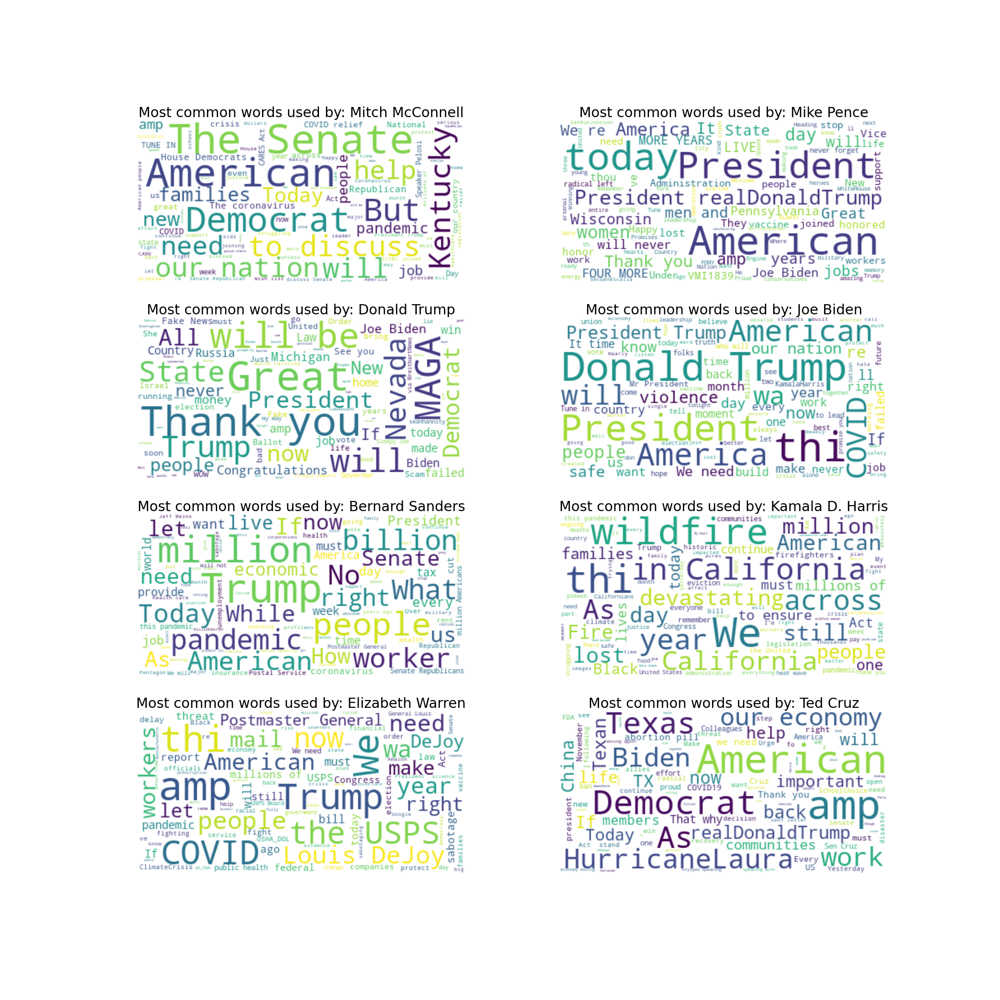

Without the stop words, the difference between the word clouds become much more apparent.  Trump and Covid are a strong talking point among all Democrats leaders, where Americans are used significantly more by the republican leaders (Although Biden also used a lot).  Furthermore, MAGA is still a unique word that’s only used by Donald Trump.  Bernie seems to focus on million and billion stills.  Warren focuses a little bit on USPS, while Bernie and Warren both mentioned workers quite a bit. 

With these words cloud, there are some reasons to believe that we can train a machine that separates the tweet of republicans and democrats leader.  

## 5. Exploratory Data Analysis + Feature Engineering (Part 2)
While word clouds provide us with good visuals representative of the corpus, it is still very qualitative.  We need more concise features for us to train any machine learning model.  In this section, I will introduce more workable features using a couple of standard NLP techniques and see if we can have potentially train models from it.  

### 1. Adding Sentimentation Score
The first advance feature we are going to introduce is the VADER (Valence Aware Dictionary for Sentiment Reasoning).  Introducing this feature allows us to capture whether the tweets have positive or negative sentiments.  If a tweet has a positive or negative sentiment, what is it towards?  Based on our word cloud earlier, Elizabeth Warren and Bernies Sanders probably have a very negative sentiment towards Donald Trump.  Therefore, this would be an excellent feature to include in our model.  

The result of the sentiment score is the calculation of the sum of all lexicon ratings.  The score is normalized between -1(most extreme negative) and +1 (most extreme positive) and following this grouping matrix.

 positive sentiment : (compound score >= 0.05)
 neutral sentiment : (compound score > -0.05) and (compound score < 0.05)
 negative sentiment : (compound score <= -0.05)

Once the general grouping is complete, let's see if any of the leaders favor positive or negative sentiment.  

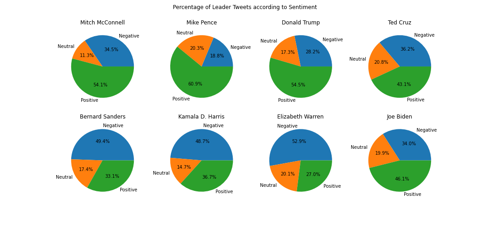

Most democratic leaders, except for Joe Biden, have more negative sentiment than the republican leaders, whereas Republicans focus more on the positive sentiment.  Could this be that Republican tends to appeal to the optimism of the people? 

### 2. Turn All Texts Lower Case

Before any Vectorization, must turn all the characters into lower case.  It will prevent the same words from being double-counted due to the case difference.

### 3. Bag of Words Feature Engineering

Now, we will introduce the feature's base on the corpus.  The first, most straightforward NLP technique for the corpus is the Bag of Words (BoW) feature engineering.  This technique counts the number of words in the corpus and assigns a vector base on its count.  
For example (This example came from Wikipedia: https://en.wikipedia.org/wiki/Bag-of-words_model):
(1) John likes to watch movies. Mary likes movies too.
(2) Mary also likes to watch football games.

These two sentences then turned into the following vector, with words being columns and numbers being attributes.  

- BoW1 = {"John":1,"likes":2,"to":1,"watch":1,"movies":2,"Mary":1,"too":1};
- BoW2 = {"Mary":1,"also":1,"likes":1,"to":1,"watch":1,"football":1,"games":1};

Specifically, we are using all leaders' tweets as our corpus and see if the politicians use the words their leaders use on an individual tweet basis.  Therefore,

-Tweet's Democrat BoW score = Number of Words used by Democrat leaders
-Tweet's Republican BoW score = Number of Words used by Republican leaders

We then graphed the distribution of the BoW scores to a normalized histogram.  

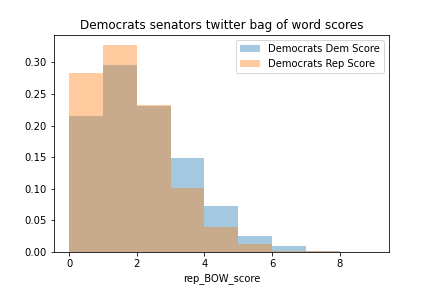
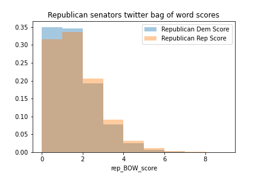

In general, we can see that Democrats have a higher Democrats BoW score than their Republican BoW score, while the same trend is reverse on Republican.  However, the differences are so subtle that perhaps we need either A) a more sophisticated feature engineering method or B) An alternative way to look at the final result

### 4. Lemming/Stemming 
Before running our last Vectorization, we will do one more feature engineering process call Lemming and Stemming.  Lemming and stemming allow us to remove a word's variation and prevent words with the same meaning from being counted separately.  

For examples:
Words vs Word
Heard vs Hear  

These words all have the same meaning.  However, they are different vector in Bag of Words or TF-IDF evaluation 

### 5. TF-IDF Feature Engineering

TF-IDF will be the last and the most sophisticated vectorizer that we used.  TF-IDF (Term Frequency Inverse Document Frequency) is a vector transformation that builds upon the bag of words vector and then refines it according to the words' proportionality in the corpus.  Doing this allows us to generate features without worrying that the number of tweets the leader's made significantly different from one another.  The equation of the TF-IDF transformation is show below

In addition to the TF-IDF, we have also generated the vectorization of n-gram of words.  N-Grams of terms allow us to distinguish contiguous sequences that may have a specific meaning when used together.  For example, ‘’Trump sucks” have a precise definition.  However, when you inference Trump and sucks individually, this pattern might not be feasible.  Another example of a sentence being separate into Bi-grams is 

-He said thank you. – {he said, said thank, thank you}

Now, although ‘said thank’ may not be meaningful.  ‘he said’ and ‘thank you’ is much more meaning than their component vectors

### 6. TF-IDF Feature Exploratory Analysis
Now we have all the features from TF-IDF.  Let’s look at how these features correlate to the politician.  Remember that since our corpus is the sum of tweets from all the political party leaders, we **hypothesized that politicians will probably use the words their leader uses more often than the opposing party.**  Therefore, what I did was calculate the Dem Score and the Rep Score of each tweet and sum them up based on the person who tweets them.  Now, each person/politician should have a total Dem Score and Rep Score.  I then graph those scores on the X-y axis as a scatter plot and using their party affiliation at a Hue

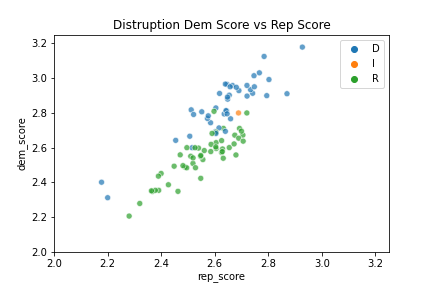

For more Analysis, I did two Scatterplots.  One includes words found common in both of their corpora, and another one has them removed.  Let's look at the one with the common words first.  You can see the 4 data outliers on the top and the graph's left side; these are your leaders.  It would make sense that since their tweets built up the corpus, their scores would be significantly favoring one side.  However, if we zoom into where most data points are, we can still see a decent separation between the two parties.  

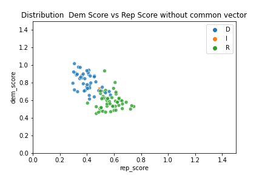

Now, without the common words, the same trend is still visible.  The scatter plot has shown us a strong indication that we can, indeed, evaluate a person's political party based on their leaders, and these features should be enough.

## 6. Model Training and Evaluation 

### 1. Scaling 
Before we trained our model, we scaled the features to ensure all the features are on the same scale.  

### 2. Model Training and Selection

Based on our data exploration, I have decided to train three models using the **tf-idf vector, sentiment compound score, Text Standard score as my features, and Party as my labels.**  Due to the clear separation of our data exploration, I have decided to choose.

- Linear Support Vector Machine Classifier (SVC)
- Random Forest Classifier (RF)
- Adaboost Classifier 

Since our goal is to evaluate intraparty dissonance, I have to decide to use leaders only for model training and evaluation.  Once the best model is selected, we will apply the model to all the other senators.  Finally, since our features include words from the test set tweet, we will use leaders tweets from another date to ensure that our model works with some unseen data.  

The best parameter was selected using a RandomSearchCV with cross-validation of 5.  The ROC/Precision-Recall curve model has shown that the Random Forest classifier and Adaboost classifier are on equal footing in performance, but SVC lags in many metrics.  We also added the confusion matrix of the RF model.  

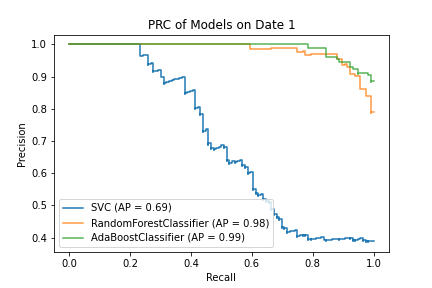
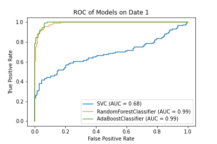
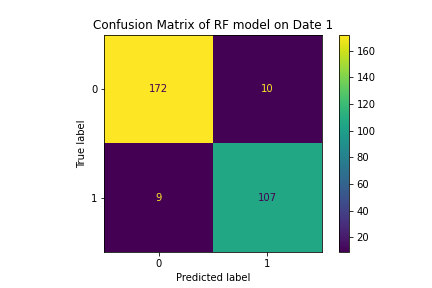

However, here it is important to note that.  For us to train an RF model, it would only take around 12 seconds, but the Adaboost model would take 232 seconds.  Therefore, if time is a concern for you, I would suggest RF models. 

### 3. Applying RF model to other Senators
Once the model is complete, let’s use it to evaluate all tweets made by all the senators and see if they are more similar to what republican leaders would tweet or what democrat leaders would tweet.  We aggregate the number of right/leader leaning tweets by Senator and graph it as a scatter plot.  

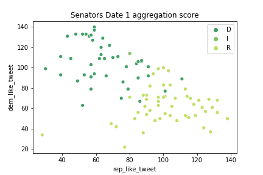

The result is just like the scatterplot in our exploratory data analysis—a clear separation between the two parties with some, but very minor, miss classification inside.  

### 4. Applying RF model to another date
Even applying the model on tweets from another date, the model could still classify the leaders' affilitation correctly roughly 80 percent of the time.   Also, the separation of the party is still visible on the aggregation of the Senator's tweets. 

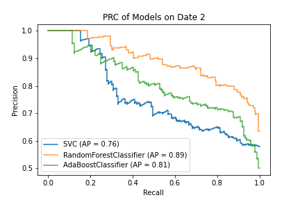
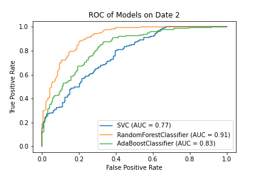
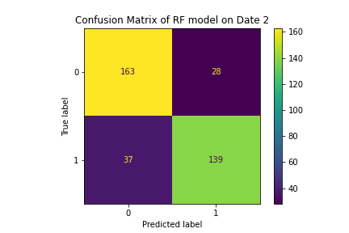
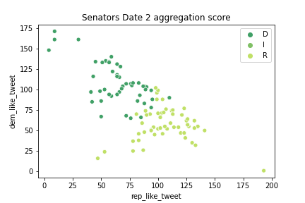

## 7. Take Away

Out of the box, both RF and AdaBoost models perform exceptionally (>90 % accuracy) at identifying the leader's party affiliation based on their tweets.  These models still maintain 80 percent accuracy when predicting tweets in the following weeks.  It is essential to note that, AdaBoost model requires up to 30-40 times more time to train.  Therefore, I recommend the RF model for this project.  

When we use the model to predict every US senators' tweets, their aggregation score shows a noticeable pattern that divides the two parties in the United States.  To my surprise, even with tweets of the following week, this pattern is still apparent.  Based on this result, it is quite convincing that we could build a quantitive, data-driven model that predicts a politician's party affiliation base on their Twitter account.  With a little bit of polishing, this model can be a method to quantify their political spectrum and to measure any intraparty dissonance.  

## 8. Future Research

While this report shows some significant results, it would be interesting to go back into the features and investigate the words that tilt a tweet's scale from being republican or democrats.  Decomposing the aggregation score using Principal Companet analysis and comparing the PCA ranking to the ideology score (like this: https://www.govtrack.us/congress/members/report-cards/2019/house/ideology) would also be very interesting.   If there is a positive correlation between the two scores, this could be an alternative method for us to review our politicians.  I would also like to expand this analysis onto the House of Representatives and see if this trend still stands.  Finally, would this evaluation method still hold on the local election level?  If it does, it would be awesome to have an app that allows you to enter a person’s Twitter account and immediately give you an idea where he lies compare to national politicians.

Another idea is to see how does the aggregation score changes at different times.  Since I am doing this project during the 2020 Presidental election, I would say the consensus is that the party a very unified.  Would we see this separation during the midterm election?  It would be interesting to find out!  

With that, the possibility of building on this model is endless.  Hopefully, you enjoy this report!  

